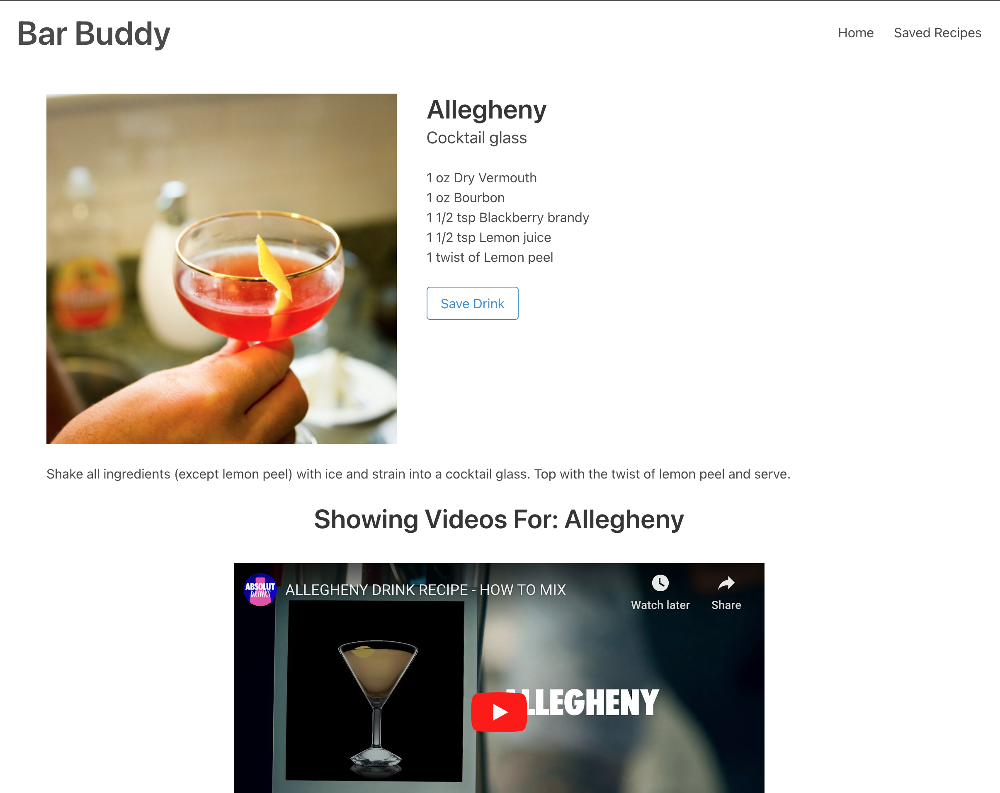

# Bar Buddy

## Description

A search tool for cocktail lovers and bartenders to find and learn how to make new drink recipes.

## Purpose/User Story

AS A bartender or cocktail-lover
I WANT to learn new cocktail recipes
SO THAT I can expand my cocktail knowledge

## Application Details

* Random Cocktail button shows the information and related videos of a random cocktail
* Ability to search for cocktails by an ingredient or drink name
* Click on any drink to be presented with cocktail name, photo, typical glassware, ingredients and amounts, instructions, and related videos
* Save recipes and information for any cocktail
* View all of the saved cocktails

## Technologies

* HTML
* Bulma CSS Framework
* JavaScript
* AJAX
* JSON
* Fetch API
* Web Storage API
* TheCocktailDB API
* YouTube Data API

## Screenshots

## Deployed Application

This application is deployed using GitHub Pages and can be accessed via this link: https://kalecodes.github.io/bar-buddy/ 

## Credit/Resources
### Contributors
    * Kalen Wiley

### Resources
    * Bulma CSS Framework (https://bulma.io/)
    * TheCocktailDB API (https://www.thecocktaildb.com/api.php)
    * YouTube Data API  (https://developers.google.com/youtube/v3/)